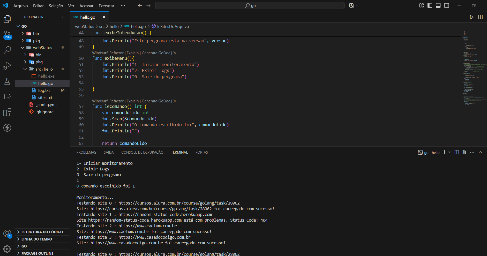

# Monitoramento de Sites em Go

Este é um simples programa de monitoramento de sites desenvolvido em Go. Ele verifica se os sites estão online e registra os resultados em um arquivo de log.

## Preview do Projeto




## Funcionalidades

- Monitora se os sites estão online (status HTTP 200).

- Lê os sites de um arquivo chamado sites.txt.

- Registra os resultados com data e hora em log.txt.

- Permite visualizar os logs de monitoramento no terminal.

## Tecnologias Utilizadas

- Go (Golang)

- Visual Studio Code

## Como executar
1. Abra o terminal integrado no arquivo hello.Go
2. Execute o programa com o seguinte comando:

```
go run hello.go
```

## 📂 Estrutura de Arquivos

```
📁 webStatus/
┣ hello.go         # Código-fonte principal
┣ sites.txt        # Lista de sites a serem monitorados
┗ log.txt          # Logs gerados automaticamente (criado ao rodar o programa)
```

## Licença
Este projeto foi desenvolvido como parte do curso de **Linguagem Go**.  


